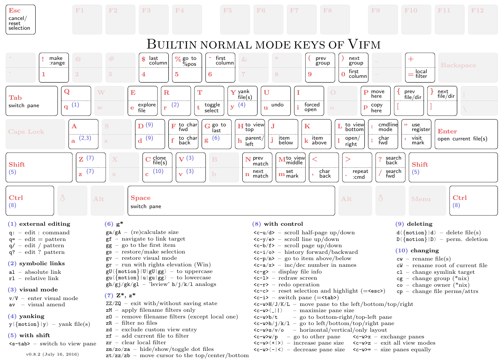
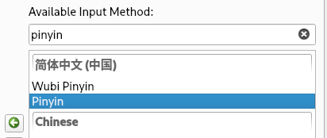

<h1 align="center"> Arch Linux 安装配置记录 <h1>

<div align="center">


</div>

<p align = "center" >
    
    
    
    <br />
    
    
    
    
    
</p>

<h3 align="center">准备工作</h3>

在安装 Arch Linux 之前 我们需要从官网或镜像网站下载系统镜像文件

> 系统镜像下载
```
https://archlinux.org/download/
```

> 镜像写入工具
```
[ BalenaEther ]     https://www.balena.io/etcher/
[ Ventoy ]          https://www.ventoy.net/cn/download.html
```

成功写入后进入`BIOS`
  - 关闭安全启动模式 `Secure Boot`
  - 调整启动项顺序或直接选择使用 **UEFI 模式** 启动U盘内镜像

如何进入 BIOS 请自行百度 这里不再赘述

----

<h2 align="center"> 安装 Arch Linux</h2>

成功进入 BIOS 并选择以 UEFI 方式启动 U盘内的系统安装镜像后 等待一会就可以看到 `archiso` 的安装命令提示符了

> 成功启动后看到的命令提示符
```
root@archiso ~ #
```

> 启动完成后速速禁用 reflector 服务，防止此服务擅自删除国内镜像源
```
systemctl stop reflector.service
systemctl disable reflector.service
```

> 检查当前是否为 `UEFI` 模式启动
```
ls /sys/firmware/efi/efivars    [ 有输出则是 UEFI 模式 ]
```

> 检查网络是否连接
```
ping www.bilibili.com
```

> 更新系统时间
```
timedatectl set-ntp true    [ 更新 ]
```

### 磁盘分区

----

<details>
<summary>章节知识点</summary>
<br />

> 知识点
```
[ 硬盘相关 ]
- M.2         [ 物理接口 与数据交换协议无关 ]
- SATA        [ SATA 是为机械硬盘传输数据而设计的串行总线 ]
- NVMe        [ 专为采用闪存技术的固态硬盘设计的数据传输协议 性能高于使用 AHCI 协议的 SATA ]

[ 分区相关 ]
- MBR         [ 主引导记录 包含操作系统启动加载器和分区表 ]
- GPT         [ 全局唯一标识分区表 是 UEFI 标准定义的分区规范 为替换 MBR 而设计 ]
- EFI / UEFI  [ 操作系统和固件之间接口的模型 提供了启动操作系统或预启动程序的标准环境 ]
- EFI System  [ 存储了 UEFI 启动所必须固件的分区 包括 EFI 引导加载器 / 应用程序 / 驱动 ]
- SWAP        [ 交换文件 当系统内存满时会将暂时用不到的内存数据存入此文件 需要时再从硬盘重新载入到内存 ]
```

> 命令简介
```
- lsblk       [ 输出分区情况 list block device ]
- cfdisk      [ 可视化分区工具 ]
- mkfs.xxx    [ 格式化并创建一个 xxx 格式的文件系统 ]
- mount       [ 挂载命令 可以把挂载简单理解为磁盘映射 ]
```

当 Linux 系统如果识别到一个磁盘 就会将其分配为一个块设备如 [ `/dev/sda` ] [ `/dev/nvme0n1` ] [ `/dev/mmcblk0` ] 用 lsblk 或 fdisk 可以查看

> [ `lsblk` ]
```
root@archiso ~ # lsblk
NAME    MAJ:MIN RM   SIZE RO TYPE MOUNTPOINTS
loop0     7:0    0 683.2M  1 loop /run/archiso/airootfs
sr0      11:0    1 794.3M  0 rom  /run/archiso/bootmnt
nvme0n1 259:0    0    48G  0 disk
```

> [ `fdisk -l` ]
```
root@archiso ~ # fdisk -l
Disk /dev/nvme0n1: 48 GiB, 51539607552 bytes, 100663296 sectors
Disk model: VMware Virtual NVMe Disk
Units: sectors of 1 * 512 = 512 bytes
Sector size (logical/physical): 512 bytes / 512 bytes
I/O size (minimum/optimal): 512 bytes / 512 bytes
```

----

</details><br />

> 使用 [ `lsblk` ] 查看当前分区状况并确定系统安装的区域 [ `nvme0n1` ]
```
root@archiso ~ # lsblk
NAME    MAJ:MIN RM   SIZE RO TYPE MOUNTPOINTS
loop0     7:0    0 683.2M  1 loop /run/archiso/airootfs
sr0      11:0    1 794.3M  0 rom  /run/archiso/bootmnt
nvme0n1 259:0    0    48G  0 disk  <-- nvme0n1 我们的目标安装硬盘

[ 结果中结尾是 `rom` `loop` 或 `airoot` 的设备可以忽略 ]
```
+ 这里我的硬盘使用 NVMe 协议 所以 [ `lsblk` ] 命令输出 [ `nvme0n1` ]
+ 如果硬盘是 SATA 协议的可能会看到 [ `/dev/sda` ]

<br />

> 运行可视化分区程序 [ `cfdisk` ] 对我们的目标硬盘 [ `nvme0n1` ] 进行分区
```
cfdisk /dev/nvme0n1
```

> [ `cfdisk` ] 基本操作
```
[  j / k  ]        - 上下移动选择目标子卷
[    n    ]        - 创建新分区
[    t    ]        - 选择分区格式
[    d    ]        - 删除目标分区
[    W    ]        - 写入操作到磁盘
[    q    ]        - 退出分区工具
[ <ENTER> ]        - 确认操作
```

> 我们按照如下方法进行分区
```
/dev/nvme0n1p1 - EFI System        [ EFI 启动分区 512M ]
/dev/nvme0n1p2 - Linux swap        [ 交换分区 与内存大小相等 ]
/dev/nvme0n1p3 - Linux filesystem  [ 根分区 余下全部大小 ]
```

<details>
<summary>使用 fdisk 确认分区结果</summary><br />

    ...
    Device            Start       End  Sectors  Size Type
    /dev/nvme0n1p1     2048    526335   524288  256M EFI System
    /dev/nvme0n1p2   526336  17303551 16777216    8G Linux swap
    /dev/nvme0n1p3 17303552 100661247 83357696 39.7G Linux filesystem

</details><br />

### 格式化新分区

----

> 现在我们对刚刚分出来的区域进行简单处理
```
mkfs.fat -F 32 /dev/nvme0n1p1  [ 将 nvme0n1p1 分区分区格式化为 FAT32 格式 用于充当系统启动目录 ]
mkfs.xfs /dev/nvme0n1p3        [ 将 nvme0n1p3 分区格式化为 XFS 文件系统 用于充当新系统的根目录 ]
```
```
root@archiso ~ # mkfs.fat -F 32 /dev/nvme0n1p1
mkfs.fat 4.2 (2021-01-31)
root@archiso ~ # mkfs.xfs /dev/nvme0n1p3
meta-data=/dev/nvme0n1p3         isize=512    agcount=4, agsize=2604928 blks
         =                       sectsz=512   attr=2, projid32bit=1
         =                       crc=1        finobt=1, sparse=1, rmapbt=0
         =                       reflink=1    bigtime=1 inobtcount=1 nrext64=0
data     =                       bsize=4096   blocks=10419712, imaxpct=25
         =                       sunit=0      swidth=0 blks
naming   =version 2              bsize=4096   ascii-ci=0, ftype=1
log      =internal log           bsize=4096   blocks=16384, version=2
         =                       sectsz=512   sunit=0 blks, lazy-count=1
realtime =none                   extsz=4096   blocks=0, rtextents=0
```

> 分给交换文件系统的 `nvme0n1p2` 建立交换分区
```
mkswap /dev/nvme0n1p2          [ 在 nvme0n1p2 分区上建立 SWAP 交换分区 ]
swapon /dev/nvme0n1p2          [ 启用 nvme0n1p2 分区上建立的 SWAP 交换系统 ]
```
```
root@archiso ~ # mkswap /dev/nvme0n1p2
Setting up swapspace version 1, size = 8 GiB (8589930496 bytes)
no label, UUID=313058b0-45b5-499c-acf3-f8fd65bdba81
root@archiso ~ # swapon /dev/nvme0n1p2
```

现在我们已经拥有一个有着最基本 Linux 分区结构的系统了！🍺

下面就让我们一起进入到刚刚的分区里安装新系统吧！

### 挂载分区

----

<details>
<summary>挂载知识点</summary><br />

 - 很多同学都知道，在 Linux 系统下 **一切皆文件**
 
 - 不管是 鼠标 键盘 还是显示器 硬盘，对 Linux 来说都是文件，只不过这几个文件比较特殊而已
 
 - 我们刚刚分出的三个区域对 Linux 来说就是三个块设备文件，如果我们想要操作这三个文件，必须先把这三个文件映射到某一个我们能操作的目录下
 
 - 这样的话 我们在那个目录里所做的一切修改 都会反映到映射的源头 也就是上面三个块设备文件

</details>

----

> 将分出的三个块设备挂载到本机的 `/mnt` 目录
```
mount /dev/nvme0n1p3 /mnt              [ 将根目录挂载到 /mnt 上 现在的 /mnt 相当于我们要安装系统的根目录 ]

mkdir -p /mnt/boot/efi                 [ 创建新系统的启动目录 ]
mount /dev/nvme0n1p1 /mnt/boot/efi     [ 将 EFI 启动目录挂载到新系统的 /boot 目录下 ]
```

<details>
<summary>df -h 检查挂载情况</summary><br />

    ...
    /dev/nvme0n1p3   40G  316M   40G   1% /mnt
    /dev/nvme0n1p1  253M   512  253M   1% /mnt/boot

</details>

----

- 现在 我们新系统的根目录就被挂载到了本机的 `/mnt` 文件夹里了！

- 我们对 `/mnt` 文件夹里做的一切修改 都会映射到新系统的根目录中 🙂

- 现在新系统根目录里除了有一个用来保存启动文件的 [ `/boot` ] 文件夹外 其他什么还都没有

- 也就是说 我们现在是无法使用这个系统的 [ 相当于你的 C 盘里有一个空的 `boot` 文件夹 ]

- 喝杯奶茶休息一下吧 🧋

### 系统核心安装

----

<details>
<summary>章节知识点</summary>
<br />

> 命令简介
```
- pacstrap    [ 将软件包安装到新的根目录中 ]
- genfstab    [ 生成符合 fstab 文件格式的输出 ]
```


> 常见的 Linux 内核版本
```
- Stable      [ 原生的 Linux 内核和模块 ]
- Longterm    [ 受长期支持的 Linux 内核和模块 最稳定 ]
- Hardened    [ 注重安全的 Linux 内核 采用一系列加固补丁以缓解内核和用户空间漏洞 ]
- Zen Kernel  [ 一些内核黑客合作开发的成果 吞吐量与功耗换取性能 适合日常使用 ]
```

<details>
<summary>啥是内核 😦</summary>

----

**内核是一个操作系统的核心 也是连接应用程序和硬件的桥梁**

内核负责管理计算机 **CPU / 内存 / 进程 / 设备驱动程序 / 文件 / 网络** 等软硬件资源

**内核的好坏直接决定了操作系统使用硬件效率的高低，宏观反应出的便是一个系统的性能与稳定性**

----

操作系统启动后，内核会以软件的形式长时间驻留在内存中完成它的工作

&emsp; 内核主要负责的工作：
 - `内存管理` &nbsp;追踪并记录内存的使用情况 为进程分配合理的内存
 - `进程管理` &nbsp;追踪并记录进程的运行情况 为进程分配合理的 CPU 资源
 - `设备驱动` &nbsp;充当软件进行与硬件之前的调解程序
 - `系统调用` &nbsp;为进程提供一套系统调用接口 允许进程通过接口与内核交互
 - `安全防护` &nbsp;提供了如进程权限要求 进程隔离 等安全措施

----

内核将计算机底层的硬件资源进行了一定的抽象 隐藏其复杂性并为程序统一提供了可用于间接访问硬件的接口

**内核不提供与用户的交互功能**，只有应用程序可以通过内核提供的 ` 系统调用接口 [SCI] ` 与内核交互

----

&emsp; 在内核的控制下 系统有两种代码执行模式
 - `用户模式` 此模式下的内核会限制 SCI 对 ` CPU / 内存 ` 的访问与控制
 - `内核模式` 此模式下的内核不会限制 SCI 对 ` CPU / 内存 ` 的访问与控制

所以在 **用户模式** 运行状态下的程序会有适当的保护措施 程序崩溃不会造成太严重的后果 内核可以修复其崩溃造成的不良影响 但假如程序在 **内核模式** 的运行状态下崩溃 则极有可能引起整个系统的崩溃

</details>

----

</details><br />

在给新系统安装的必要的组件前，我们先更新一下本地软件安装管理器数据库

> 将国内服务器地址加入到软件安装管理器镜像地址列表顶端
```
[ vim /etc/pacman.d/mirrorlist ]

Server = https://mirrors.ustc.edu.cn/archlinux/$repo/os/$arch
Server = https://mirrors.tuna.tsinghua.edu.cn/archlinux/$repo/os/$arch
```
- 添加完成后按 `ESC` 退出插入模式 然后输入 `:wq` 回车即可保存

> 让本地软件管理器与服务器同步一下数据
```
pacman -Syy
```

> 安装必要组件
```
pacstrap /mnt linux-zen         [ 系统内核与模块 ]
pacstrap /mnt linux-zen-headers [  ]
pacstrap /mnt linux-firmware    [ Linux 驱动与固件 ]

pcastrap /mnt base              [ Arch 安装的最小软件包集 ]
pacstrap /mnt base-devel        [ AUR 构建工具 ]
pacstrap /mnt vim               [ VIM 编辑器 ]
```

<details>
<summary>题外话：base-devel 里有些什么？</summary><br />

    archlinux-keyring []
    autoconf          [ ]
    automake          [ 自动编译工具 ]
    binutils          []
    bison
    fakeroot
    file
    findutils
    flex
    gawk              [ 文本处理工具 ]
    gcc               [ C 代码编译工具 ]
    gettext
    grep              [ 文件内容查找工具 ]
    groff
    gzip              [ 压缩解压工具 ]
    libtool
    m4
    make              [ C 构建工具 ]
    pacman            [ 软件管理工具 ]
    patch
    pkgconf
    sed               [ 文件处理工具 ]
    sudo
    texinfo
    which

</details>

---

> 让 Arch 开机自动挂载硬盘
```
genfstab -U /mnt >> /mnt/etc/fstab  [ 生成 fstab 文件 ]
cat /mnt/etc/fstab                  [ 检查是否正确生成 ] [ 假如对自己的的操作足够自信也可以不查 ]
```

假如你仔细思考并认真实践了安装指南，那么恭喜你！ 🧀

现在一个可以正常使用的 Arch Linux 就已经成功安装到了你之前指定的硬盘上了 [ 但此时仍无法通过启动进入 原因是还没安装系统引导程序 ]

下面我们需要进入刚刚安装的系统里进行进一步的配置了，准备好了吗？

### 系统基础配置

----

> 切换到到新安装的系统中
```
arch-chroot /mnt
```

> 为你的刚刚安装的 Arch Linux 起一个屌炸天的名字吧 😎
```
echo "UNEXPECTED" > /etc/hostname   [ 我为他起的名字是 UNEXPECTED ]
```

> 配置本地软件数据库
```
[ vim /etc/pacman.conf ]
```

> 去掉下面两行开头的 `#` 号 开启老版本 32 位软件的支持
```
#[multilib]
#Include = /etc/pacman.d/mirrorlist
```

> 在文件末尾添加中国镜像仓库源
```
[archlinuxcn]
Server = https://mirrors.ustc.edu.cn/archlinuxcn/$arch
Server = https://mirrors.tuna.tsinghua.edu.cn/archlinuxcn/$arch
```
- 添加完成后按 `ESC` 退出插入模式 然后输入 `:wq` 回车即可保存

>  同步 pacman 官方源到本地软件数据库
```
pacman -Syyu
```

> 添加以下 hosts 映射
```
[ vim /etc/hosts ]

127.0.0.1   localhost
::1         localhost
```

> 设置系统时区
```
ln -sf /usr/share/zoneinfo/Asia/Shanghai /etc/localtime
```

> 同步硬件时间
```
hwclock --systohc
```

> 设置系统语言
```
[ vim /etc/locale.gen ]

使用 / 查找 en_US.UTF-8 UTF-8  将光标移动到开头的 # 号上按 x 将其删除
使用 / 查找 zh_CN.UTF-8 UTF-8  将光标移动到开头的 # 号上按 x 将其删除
```
- 按下 ESC 并输入:wq 回车即可退出 VIM

> 生成 `locale`
```
locale-gen
```

> 系统区域设置
```
echo "LANG=en_US.UTF-8" > /etc/locale.conf
```

> 设置 root 密码
```
passwd root
```

**注意：此时用户是无法看到输入的密码的 这是Linux的一个特性 并不是键盘坏了！** 😆

> 创建新用户 xxx
```
useradd -m -G wheel -s /bin/bash xxx
```

> 给新用户设置密码
```
passwd xxx
```

> 更改sudo用户组权限细节
```
[ vim /etc/sudoers ]

#%wheel ALL=(ALL:ALL) NOPASSWD: ALL  [ 去掉最开头的 # 号 ]
```
去掉后按 `ESC` 退出插入模式 然后输入 `:wq!` 回车即可强制保存

> 安装网络管理器 [ NetworkManager ]
```
pacman -S networkmanager
```

> 配置网络管理器开机启动
```
systemctl enable NetworkManager
```

> 安装微码 [ 根据自己的处理器品牌安装 ]
```
[  AMD  ]   pacman -S amd-ucode
[ Intel ]   pacman -S intel-ucode
```

<br />
<details>
<summary>题外话：啥是微码 🤔</summary><br />

> 处理器制造商会发布对处理器微码的稳定性和安全性更新。这些更新提供了对系统稳定性至关重要的错误修复。如果没有这些更新，则可能会遇到不明原因的崩溃或难以跟踪的意外停机。
> 使用 AMD 或 Intel CPU 的用户都应该安装微码更新以确保系统稳定性。

</details>

----

> 安装 GRUB 启动引导器
```
pacman -S grub         [ GRUB 启动引导器 ]
pacman -S efibootmgr   [ UEFI 启动管理器 ]

pacman -S os-prober    [ 多系统检测程序 ] [ 可选 ]
```

> 安装启动引导到UEFI分区
```
grub-install --target=x86_64-efi --efi-directory=/boot/efi --bootloader-id=ARCH
```

> 优化 GRUB 配置 [ 可选 ]
```
[ vim /etc/default/grub ]

GRUB_CMDLINE_LINUX_DEFAULT="loglevel=3 nowatchdog"

[ 其他内核 + NVIDIA ]
GRUB_CMDLINE_LINUX_DEFAULT="loglevel=3 nowatchdog nvidia-drm.modeset=1"

[ 若您安装了多系统 需要加上 ]
GRUB_DISABLE_OS_PROBER=false
```

> 生成 GRUB 配置文件
```
grub-mkconfig -o /boot/grub/grub.cfg
```

恭喜你！现在的 Arch Linux 已经可以正常启动了！ 🎉

执行 `exit` `reboot` 即可重启电脑，重新开启前不要忘了拔掉U盘哦 🙂

赶快试一试新的系统吧！

### 图形界面安装

----

如果上面的安装步骤都没错，重启后我们会进入一个黑乎乎的终端，丝毫没有现代操作系统的感jio

下面就让我们一起来安装图形操作界面吧！😀

在安装图形界面之前，我们需要安装一下显卡驱动 [ 虚拟机不需要安装显卡驱动 ]

#### Nvidia 驱动安装

----

安装显卡驱动时，请尽量避免从 NVIDIA 官网下载驱动包进行安装

通过 [ `pacman` ] 来安装的 NVIDIA 驱动能够在更新系统时与其他组件一同更新

<details>
<summary>Arch Linux 官方文档</summary>

    支持的显卡：
    GeForce 930起、10系至20系、 Quadro/Tesla/Tegra K-系列以及更新的显卡（NV110以及更新的显卡家族），安装 nvidia （用于linux） 或者 nvidia-lts （用于linux-lts）
    假如您是使用最新的显卡，如果以上两个驱动安装后都不能正常工作，您也许需要使用 nvidia-betaAUR 和 nvidia-utils-betaAUR 来获得支持
    2013年至2014年左右的开普勒（NVE0）系列（包括GeForce 630-920），安装nvidia-470xx-dkmsAUR
    GeForce 400/500/600 系列（ NVCx 以及 NVDx ），大概是2010年至2011年的显卡，安装 nvidia-390xx-dkmsAUR.
    对32位应用程序支持，请安装multilib仓库中对应的 lib32 nvidia 软件包（例如lib32-nvidia-utils）

    老显卡：
    如果你的显卡是 GeForce 300 系列或者更老的（发布于2010年及之前），Nvidia不再为这些显卡提供驱动。这意味着这些驱动不支持现在的Xorg版本。因此使用 Nouveau 驱动可能会更方便，因为它依然为这些老显卡提供对当前Xorg的支持。
    但是，Nvidia 依然提供 legacy 驱动，并且或许拥有更好的 3D 性能（稳定性）。
    GeForce 8/9、ION以及100至300系列显卡（NV5x、NV8x、NV9x以及NVAx），安装 nvidia-340xx-dkmsAUR。
    GeForce 7系列及更老的显卡（NV6x、NV4x及以下），Arch Linux没有相应的驱动包。

</details><br />

> 我的显卡是 RTX 2080 Ti 所以选择安装以下安装包
```
[ 原生内核 ]
sudo pacman -S nvidia nvidia-utils lib32-nvidia-utils
```

```
[ 其他内核 ]
sudo pacman -S nvidia-dkms nvidia-utils lib32-nvidia-utils
```

驱动安装好之后使用 `reboot` 重启就可以开始安装图形化管理器了 🥑

#### 图形化管理器安装

----

Linux 下的图形化界面管理器有很多，其中比较主流的有

+ KDE   强大 配置性高
+ XFCE  轻量 启动速度飞快
+ GNOME 简约 同时注重界面的操作性

笔者个人比较喜欢 GNOME，因为其拥有比肩 MacOS 的简洁的外观 同时又不失操作性

> 安装 GNOME 与 窗口管理器 GDM
```
sudo pacman -S gnome
sudo pacman -S gdm
```

> 配置自动在开机时启动 GNOME
```
sudo systemctl enable gdm.service
```

> 中文字体显示乱码解决办法
```
[ 安装中文字体 ]
sudo pacman -S wqy-microhei
```

执行 `reboot` 重启系统即可看到我们安装的 GNOME 啦 🎉

<h2 align="center">软件配置安装</h1>

----

在 Linux 下安装软件通常有两种方式：
 - 自行下载软件源码编译构建安装
 - 通过软件包管理器安装从软件仓库下载安装

<details>
<summary> &nbsp; 两种安装方式的优缺点</summary><br />

> &emsp;**[ &nbsp;下载软件源码编译安装 &nbsp;]**
> - **优点：** 只要有软件的源代码就可以进行编译安装 可以在编译前对软件进行一些个性化定制
> - **缺点：** 安装比较繁琐，需要熟悉软件构建工具的使用，编译可能会因为缺少库文件失败

> &emsp;**[ &nbsp;通过软件包管理器安装 &nbsp;]**
> - 优点： 无需自行寻找软件源代码安装，方便快捷，一般不会出现不兼容的问题
> - 缺点： 安装的软件可能不是最新的版本 不能对软件进行个性化编译定制

</details>

----

> Arch 下比较常用的几个软件包管理器
```
pacman      [ Arch 自带包管理工具 不是很全 安装必须使用 sudo 提升权限 ]
yay         [ Go 语言开发的包管理工具 ]
paru        [ Rust 开发的包管理工具 ]
```

这里我们使用 [ `paru` ] 包管理器对软件进行安装与管理

> 安装 [ `paru` ]
```
sudo pacman -Syyu   [ 让本地 pacman 软件版本数据库与云端同步并更新所有软件 ]
sudo pacman -S paru [ 使用 pacman 安装 paru ]
```

<details>
<summary>&nbsp; <code>'xxx' is unknown trust</code></summary><br />

> 方法一
```
pacman-key --init
pacman-key --populate
pacman-key --refresh-key
```

> 如果上面卡住太久 那么就用下面这个简单粗暴的方法
```
[ vim /etc/pacman.conf ]

...
SigLevel = Never
```

</details>

----

> [ `paru` ] 的基本使用
```
paru -Syyu      [ 更新本地软件并刷新软件版本数据库 ]
paru -S xxx     [ 安装 xxx ]
paru -R xxx     [ 卸载 xxx ]
```

> 题外话：软件包仓库中后缀有 `-git` `-bin` 与没有后缀的区别？
```
xxx         [ 可能是已经编译好的二进制文件 也有可能是未经编译的源代码 ]
xxx-bin     [ 已经编译好的二进制文件 下载即可使用 无需自行编译 无法保证是最新的 ]
xxx-git     [ 从软件仓库克隆最新的软件源码到本地编译安装 软件可能存在 不适配 不稳定 的情况 ] ```
```
- 编译需要一定的时间 视 CPU 性能而定
- 若环境配置不当如 [ 缺少编译工具 ] 编译大概率会失败

*注：不会科学上网的话最好优先安装 `-bin` 版本的软件包*

----

### Fish Shell

----

<details>
<summary>&nbsp;  简介</summary>

----

由于系统内核没有向用户提供任何交互的功能，人们设计出了能够直接与系统内核交互的程序来间接地控制与管理操作系统

**Shell 就像是一个将系统内核包裹住的壳 既提供了对内核的保护 也提供了与系统内核交互的功能 **

Shell 通常分为两大类：
 - `命令界面 Shell [ CLI ]` &nbsp;通过 **命令行** 的方式与系统内核交互
 - `图形界面 Shell [ GUI ]` &nbsp;通过 **可视化** 的方式与系统内核交互

之前我们安装的 GNOME 其实就是一个图形界面的 GUI Shell，我们可以在这个 Shell 中用鼠标完成绝大部分的操作

*Windows 系统下的 `explorer.exe` 也是一个 GUI Shell*

----

下面罗列了几个常见的 [ `CLI Shell` ]

&emsp;类 Unix 系统：
 - `[ sh ]`   &nbsp;&emsp; 较早的 Linux Shell
 - `[ Bash ]` &nbsp;&nbsp;大部分 Linux 的默认 Shell
 - `[ Zsh ]`  &nbsp;&nbsp;&nbsp; 新版 MacOS 的默认 Shell 一些 Linux 发行版也选择了 Zsh 作为默认的 Shell
 - `[ Fish ]` &nbsp;&nbsp;一款以友好交互性著称的 Shell 也是目前体验最好的 Shell

&emsp;Windows 系列：
 - `[ command.com ]` &nbsp;Windows 95 / 98 内核默认 Shell
 - `[ cmd.exe ]` &emsp;&emsp;&nbsp;Windows NT 内核默认 Shell
 - `[ powershell.exe ]`  用于增强 `cmd.exe` 功能的 PowerShell

----

Shell 程序在提供给用户与内核交互能力的同时 也为我们提供了一种 **命令语言** 来实现与操作系统的自动化交互

为了方便 Shell 解释器对 Shell 脚本进行解析 不同的 Shell 脚本会拥有 **不同文件标识**

Windows 内核利用后缀区分文件类型，所以在 Windows 会根据后缀的不同使用不同的解释器进行解析
 - `.bat` `command.com` 解析器默认解析后缀
 - `.cmd` `cmd.exe`&emsp;&emsp; 解析器默认解析后缀
 - `.ps1` `PowerShell` &nbsp; 解析器默认解析后缀

Linux 下一般通过 在文件头使用 `#!` 指定文件的解析程序
 - `#!/bin/sh`   &nbsp;&emsp;指定使用 `/bin/sh`   来解析脚本
 - `#!/bin/bash` &nbsp;指定使用 `/bin/bash` 来解析脚本
 - `#!/bin/fish` &nbsp;指定使用 `/bin/fish` 来解析脚本
 - `#!/bin/zsh`  &nbsp;&nbsp; 指定使用 `/bin/zsh`  来解析脚本

----

</details><br />

> 安装 Fish Shell
```
paru -S fish-git
```

> 切换默认 SHELL 为 Fish Shell
```
chsh -s /usr/bin/fish
```

> 安装 autojump
```bash
paru -S autojump
```

> 在 [ `~/.config/fish/config.fish` ]  中索引 `autojump` 文件
```bash
source /usr/share/autojump/autojump.fish
```

> 安装 oh-my-fish [ 可选 ]
```bash
curl https://raw.githubusercontent.com/oh-my-fish/oh-my-fish/master/bin/install | fish
```

<details>
<summary> Fish 官方文档 </summary>

- [ `Document` ] &emsp; <https://fishshell.com/docs/current/index.html>
- [ `Tutorial` ] &emsp; <https://fishshell.com/docs/current/tutorial.html>
- [ `Example` ]  &emsp; &nbsp; <https://github.com/NEX-S/dotfiles/blob/main/config.fish>

</details>

----

### Alacritty

----

Alacritty 是一个 Rust 编写的 **终端模拟器**，因为使用了 GPU 加速，Alacritty 非常的流畅丝滑

<details>
<summary>&nbsp; 终端又是啥&nbsp; 🤯 </summary>

----

早期的计算机没有专门负责输入输出的设备，人们为了能够与计算机交互 设计出了终端 [ `Terminal` ]

那时的终端作为一个 **独立的设备** 存在，我们向计算机的一切 `输入 / 输出` **必须通过终端** 来完成

随着计算机的发展，终端渐渐与操作系统集成在了一起，原先的功能被 显示器 键盘 等输入输出设备所替代

现代 **终端模拟器** 的作用就是在图形化界面中 **模拟出一个终端窗口**，在这个窗口中我们可以输入任何想让计算机执行的命令并等待计算机输出结果

*注意：终端只负责为我们提供了一个能够 **输入字符** 并 **显示输出** 的基本环境，提供与系统交互功能的是运行在终端上的 Shell 程序*

<details>
<summary>&nbsp; 什么是多终端？ tty 又是什么？ </summary>

----

早期的计算机制造成本非常高，为了能够最大化地利用计算机资源，人们急需一个支持 **多个用户** 同时对计算机进行操作的系统

如果每个用户使用一个终端对计算机操作，那么这个系统也必需得支持 **多个终端**

经过工程师们的不懈努力，世界上第一个支持多用户的操作系统 Unix 应运而生 🎉

在 Unix 系统中，每个终端拥有一个独立的编号 `tty*`，不同的操作员可以通过登陆不同编号的终端达到同时控制一台计算机的效果 😃

由 Unix 发展而来的 Linux 自然也继承了这个特性 🀄

----

前面提到了在 Unix 下 **一切皆文件**

Linux 专门有一个存放设备文件的目录 [ `/dev` ]，不同的设备会被抽象成不同的文件放在这个目录中

+ `ls -l /dev`

> 一些我们比较熟悉的设备
```bash
...
drwxr-xr-x        - root  1 Oct 18:44 cpu   [ CPU  ]
drwxr-xr-x        - root  1 Oct 18:44 disk  [ 硬盘 ]
crw-r-----      1,1 root  1 Oct 18:44 mem   [ 内存 ]
lrwxrwxrwx       15 root  1 Oct 18:44 stdin -> /proc/self/fd/0  [ 标准输入设备 ]
lrwxrwxrwx       15 root  1 Oct 18:44 stdout -> /proc/self/fd/1 [ 标准输出设备 ]
```

> 同样被抽象为文件的终端设备也在这个目录中
```bash
...
crw--w----      4,0 root  1 Oct 18:44 tty0
crw--w----      4,1 root  1 Oct 18:44 tty1
crw--w----      4,2 nex   1 Oct 20:07 tty2
crw--w----      4,3 root  1 Oct 18:44 tty3
crw-------      4,4 nex   1 Oct 20:08 tty4
crw--w----      4,5 root  1 Oct 18:44 tty5
crw--w----      4,6 root  1 Oct 18:44 tty6
```

使用 [ `Ctrl` + `Alt` + ` F1 / F2 / F3 ..` ] 可以快速切换到 `tty1 / tty2 / tty3 ...`

</details>

</details>

----

> 安装 Alacritty

```
paru -S alacritty-git
```

<details>
<summary>配置文档</summary><br />

官方配置示例：
- <https://github.com/alacritty/alacritty/blob/master/alacritty.yml>

笔者个人配置：
- <https://github.com/NEX-S/dotfiles/blob/main/.alacritty.yml>

</details>

---

<!-- ### Ranger -->
<!---->
<!-- ---- -->
<!---->
<!-- Ranger 是一个由 Python 写成的终端文件管理器 -->
<!---->
<!-- > 安装 Ranger -->
<!-- ``` -->
<!-- paru -S ranger-git -->
<!-- ``` -->
<!---->
<!-- <details> -->
<!-- <summary>使用指南</summary> -->
<!---->
<!--  -->
<!---->
<!-- > 常用快捷键 -->
<!-- ``` -->
<!-- [ 移动 ] -->
<!-- j / k           上下移动 -->
<!-- J / K           下半页 / 上半页 -->
<!-- h / l           父目录 / 子目录 -->
<!-- H / L           历史返回 / 历史前进 -->
<!-- gg              跳转列表顶部 -->
<!-- G               跳转列表底部 -->
<!-- /               搜索文件 -->
<!-- n               下个搜索结果 -->
<!-- N               上个搜索结果 -->
<!---->
<!-- [ 快速跳转 ] -->
<!-- gh              跳转用户家目录 [ ~ ] -->
<!-- gr              跳转根目录     [ / ] -->
<!-- ge              跳转配置目录   [ /etc ] -->
<!-- gu              跳转           [ /usr ] -->
<!---->
<!-- [ 切换显示 ] -->
<!-- ~               切换显示模式 -->
<!-- o               更改文件排序方式 -->
<!-- zh              显示隐藏文件 -->
<!-- S               暂时退出终端 -->
<!-- <C-n>           创建新标签页 -->
<!-- <TAB>           下个标签页 -->
<!-- <S-TAB>         上个标签页 -->
<!-- <C-w>           关闭标签页 -->
<!-- <A-NUM>         标签页跳转 -->
<!---->
<!---->
<!-- [ 文件操作 ] -->
<!-- r               选择文件打开方式 -->
<!-- <CR>            使用默认方式打开文件 -->
<!-- <SPACE>         选择文件 -->
<!-- dD              删除文件 -->
<!-- cw              文件重命名 -->
<!-- a               添加后缀 -->
<!-- yy              复制文件 -->
<!-- dd              剪切文件 -->
<!-- pp              粘贴文件 -->
<!---->
<!-- [ 命令模式 ] -->
<!-- :chmod 777      更改文件权限 -->
<!-- :shell / !      执行 Shell 命令 -->
<!---->
<!-- [ 文件占位符 ] -->
<!-- %f              光标文件 -->
<!-- %d              当前目录 -->
<!-- %s              选中的文件 -->
<!-- ``` -->
<!---->
<!-- ---- -->
<!---->
<!-- Ranger 拥有四个主要的配置文件： -->
<!---->
<!-- - rc.conf &nbsp;&nbsp;&nbsp;&nbsp;&nbsp;&nbsp;&nbsp;&nbsp;&nbsp;&nbsp;&nbsp;&nbsp;&nbsp;选项设置及快捷键 -->
<!-- - rifle.conf &nbsp;&nbsp;&nbsp;&nbsp;&nbsp;&nbsp;&nbsp;&nbsp;&nbsp;&nbsp;指定文件的默认打开程序 -->
<!-- - scope.sh &nbsp;&nbsp;&nbsp;&nbsp;&nbsp;&nbsp;&nbsp;&nbsp;&nbsp;指定文件的预览程序 -->
<!-- - commands.py &nbsp;保存了能通过 `:` 所执行的命令 -->
<!---->
<!-- 官方文档： -->
<!-- - <https://github.com/ranger/ranger/wiki> -->
<!---->
<!-- </details> -->
<!---->
<!-- ---- -->

### VIFM

----

VIFM 是一个由 C 写成的终端文件管理器

> 安装 VIFM
```
paru -S vifm-git
```

<details>
<summary>使用指南</summary><br>



> 常用快捷键
```

```

----

官方文档：
- <https://wiki.vifm.info/index.php/Manual>

</details>

----


### GIT

----

> 安装 GIT
```
paru -S git
```

> 配置 GIT 个人信息
```
git config --global user.name "NEX"
git config --global user.email "veperx@icloud.com"
```

> 配置 GIT 文本编辑器
```
git config --global core.editor nvim
```

> 配置 GIT 差异分析工具
```
git config --global merge.tool ???
```

<details>
<summary>GitHub 添加 SSH</summary><br />

> 生成 SSH-Key
```
ssh-keygen -t rsa -C "GitHub Email"
```

> GitHub 添加生成公钥
```
打开 GitHub -> 右上角 Settings -> 左栏 SSH and GPG Keys -> New SSH Key

标题可随意填写 下方输入框内填写公钥内容 [ ~/.ssh/id_rsa.pub ]
```

</details>

----

### Chrome

----

> 安装
```
paru -S google-chrome
```

> 插件推荐
```
[ 插件 ]
HackBar [ 这个干嘛的不能说 ]
Vimium  [ 用 VIM 键位浏览网页 效率UPUP ^_^ ]
AdBlock [ 屏蔽广告小插件 ]

Wappalyzer          [ 网站指纹识别 ]
Grammarly           [ 自动检查英语语法并提出建议 ]
SingleFile          [ 保存网页到一个 HTML 文件 ]
Bookmark Sidebar    [ 侧栏显示收藏书签 ]
Infinity New Tab    [ 美化新标签页 ]
Simple Translate    [ 划词翻译 支持 DeepL API ]
Proxy SwitchyOmega  [ 快速切换浏览器代理 ]

JavaScript and CSS Beautifier   [ 自动格式化 JS CSS 源码 ]

[ 主题 ]
Brave
Crown
Pastel Rainbow
Ultra Violet
```

### Fcitx 5
----

Fcitx 5 只是一个基本的输入法框架，若要输入中文则需要额外安装中文包

> 安装基本框架
```
paru -S fcitx5-git              [ 基本框架 ]
paru -S fcitx5-configtool-git   [ 框架配置工具 ]
```

> 安装中文拓展包
```
paru -S fcitx5-chinese-addons-git
```

> 安装兼容模块
```
paru -S fcitx5-gtk-git          [ GTK 兼容模块 ]
paru -S fcitx5-qt5-git          [ qt5 兼容模块 ]
paru -S fcitx5-qt6-git          [ qt6 兼容模块 ]
paru -S fcitx5-qt4              [ qt4 兼容模块 ]

```

> 安装皮肤 [ 可选 ]
```
paru -S fcitx5-nord
```

> 编辑 [ `/etc/environment` ] 加入以下内容
```
GTK_IM_MODULE=fcitx
QT_IM_MODULE=fcitx
XMODIFIERS=@im=fcitx
SDL_IM_MODULE=fcitx
GLFW_IM_MODULE=ibus
```

> 重启后在应用列表搜索 `fcitx5` 打开 `configuration`


> 右侧搜素栏搜索 `pinyin` 并双击 [ 或者点击箭头移到左边 ]



> 点击下方 Apply 应用更改，重启系统后就可以使用 [ `Ctrl-空格` ] 切换输入了

<details>
<summary>常用配置</summary><br />

若不满意 Fcitx 5 的默认配置，可以到 [ `fcitx5 configuration` ] 里配置

> [ `Global Options` ]
```
Trigger Input Method     [ 切换输入模式 默认 Ctrl+空格 ]
Temporally switch ...    [ 临时切换中英文 默认 Left Shift ]
Default Previous Page    [ 结果上一页 ]
Default Next Page        [ 结果下一页 ]
Default Next Candidate   [ 选中下一个结果 ]
```

> [ `Addons` ]
```
Classic User Interface      [ Fcitx5 UI 设置 ]
  - Font    [ 字体 ]
  - Theme   [ 主题 ]
```

</details>

----

### Sublime-Text 4

---

> 安装
```
paru -S sublime-text-4
```

> 激活
```
—– BEGIN LICENSE —–
Mifeng User
Single User License
EA7E-1184812
C0DAA9CD 6BE825B5 FF935692 1750523A
EDF59D3F A3BD6C96 F8D33866 3F1CCCEA
1C25BE4D 25B1C4CC 5110C20E 5246CC42
D232C83B C99CCC42 0E32890C B6CBF018
B1D4C178 2F9DDB16 ABAA74E5 95304BEF
9D0CCFA9 8AF8F8E2 1E0A955E 4771A576
50737C65 325B6C32 817DCB83 A7394DFA
27B7E747 736A1198 B3865734 0B434AA5
—— END LICENSE ——
```

> 配置
```
Ctrl + Alt + p      [ 打开命令面板 ]
```

<details>
<summary>配置文档</summary><br />

官方文档：
+ <https://www.sublimetext.com/docs/>

社区文档：
+ <https://docs.sublimetext.io/guide/>

</details>

----

### Visual Studio Code

----

> 安装
```
paru -S visual-studio-code-bin
```

> 插件推荐
```
code runner
```

> 配置
```

```

<details>
<summary>配置文档</summary><br />

<https://code.visualstudio.com/docs>

</details>

----

### VMware Workstation 16

----

> Windows 16 Professional 激活码
```
YF390-0HF8P-M81RQ-2DXQE-M2UT6
```

> 没有找到 Vmmon
```
sudo pacman -S linux-headers
```

> 开机启动 VMware 网络服务 [ 不然虚拟机开启可能无法上网 ]
```
sudo systemctl enable vmware-networks.service
```

> Windows 10 安装
```
https://www.microsoft.com/zh-cn/software-download/windows10ISO

P4KWK-XDQTK-XYMCQ-GX6QJ-RCDVM
```

### Virtual Box

----

> 安装
```
sudo pacman -S virtualbox-bin
```

> 安装内核模块
```
[ 原生内核 ] sudo pacman -S virtualbox-host-modules-arch
[ 其他内核 ] sudo pacman -S virtualbox-host-dkms
```

### Docker

---

Docker 是一个利用了 LXC 容器技术的轻量级虚拟机


> 安装 Docker
```
paru -S docker
```

由于 Docker 提供了进程级别的隔离技术，所以运行时必须提升系统操作权限，将当前用户加入 Docker 组可以避免每次运行输入 `sudo` 提权

> 将当前用户加入 Docker 组
```
sudo groupadd docker
sudo usermod -aG docker $USER
```

> 开机启动 Docker 服务
```
sudo systemctl enable --now docker.service
```

<details>
<summary>常用命令</summary>

> TODO
```

```

</details>

----

### BurpSuite

----

> 下载地址
```
https://portswigger.net/burp/releases#professional
```

> 注册机地址
```
https://github.com/h3110w0r1d-y/BurpLoaderKeygen
```

<!-- > 安装 JAVA 运行环境 -->
<!-- ``` -->
<!-- paru -S openjdk17-src -->
<!-- ``` -->

> 其他常用软件安装
```
[ 常用软件 ]
paru -S translate-shell-git [ 命令行翻译 ]
paru -S man-db				[ Linux Manual ]
paru -S python-pip          [ Python 包管理工具 ]

[ 系统功能增强 ]
paru -S exa-git             [ ls   增强 ]
paru -S bat-git             [ cat  增强 ]
paru -S ripgrep-git         [ grep 增强 ]
paru -S tldr-git            [ man 精简版 ]


[ 其他 ]
paru -S brave-nightly-bin        [ Brave 浏览器 ]
paru -S termius                  [ SSH 工具 ]

paru -S obs-studio               [ OBS ]
paru -S mpv-git                  [ 播放器 ]
paru -S zy-player-bin            [ 在线播放器 ]
paru -S motrix-git               [ 下载工具 ]

paru -S typora                   [ 笔记工具 ]
paru -S obsidian                 [ 笔记工具 ]

paru -S ristretto                [ 图片查看器 ]
paru -S nomacs-git               [ 图片编辑工具 ]

paru -S spotify                  [ Spotify ]
paru -S netease-cloud-music      [ 网抑云音乐 ]
paru -S yesplaymusic             [ 第三方网易云 ]
paru -S listen1-desktop-appimage [ 全网歌曲播放器 ]

paru -S wechat-uos               [ 微信 ]
paru -S wemeet-bin               [ 腾讯会议 ]
paru -S baidunetdisk-bin         [ 百度网盘 ]

paru -S com.tencent.meeting.deepin [ WINE 腾讯会议 ]
paru -S com.qq.weixin.deepin       [ WINE 微信]
```

> 特殊软件
```
paru -S clash                    [ 梯子 ]
paru -S tor-browser              [ TOR 浏览器 ]
paru -S telegram-desktop-git     [ TELEGRAM ]
```

> 道也者 不可须臾离也。可离 非道也。是故君子戒慎乎其所不睹 恐惧乎其所不闻。莫见乎隐 莫显乎微 故君子慎其独也。

### GNOME 优化配置

----

默认的 GNOME 主题好像有点丑 🙁

下面就让我带着大家优化 GNOME，一起打造一个属于我们自己的 Linux 桌面吧 🤪

----

> 安装 GNOME 主题优化工具
```
paru -S gnome-tweaks-git
```

> 安装 GNOME 扩展
```
paru -S gnome-shell-extensions-git                   [ GNOME 扩展管理工具 ]

paru -S gnome-shell-extension-dash-to-dock-git       [ GNOME 应用栏 ]
paru -S gnome-shell-extension-unite-git              [ GNOME UNITE 扩展 ]
paru -S gnome-shell-extension-proxy-switcher-git     [ GNOME 系统代理切换工具 ]
paru -S gnome-shell-extension-simple-system-monitor  [ GNOME 性能监控 ]
paru -S gnome-shell-extension-system-monitor-git     [ GNOME 性能监控 ]

paru -S gnome-terminal-transparency                  [ GNOME 透明终端 ]
```

> 下载系统主题 WhiteSur 解压并安装
```
[ https://github.com/vinceliuice/WhiteSur-gtk-theme ]

./install.sh -t yellow -s 260 -i arch -HD -P smaller --round && ./install.sh -t yellow -s 260 -i arch -HD -P smaller --nord --round
```

> 下载图标并复制到 [ `~/.icons` ] 文件夹
```
[ https://github.com/NEX-S/Arch-Linux-Install-Guide-ZH/blob/main/tweaks/icons.zip ]

unzip icons
cp -r icons/* ~/.icons
```

> GRUB 启动界面美化
```
[ https://github.com/NEX-S/Arch-Linux-Install-Guide-ZH/blob/main/tweaks/xenlism-grub-4k-kali.tar.xz ]

sudo ./install.sh
```

> GNOME 开启 WAYLAND 支持 [ 可选 ]
```
sudo mv /usr/lib/udev/rules.d/61-gdm.rules /usr/lib/udev/rules.d/61-gdm.rules.bak
sudo ln -s /dev/null /etc/udev/rules.d/61-gdm.rules

paru -S --needed glfw-wayland xorg-xwayland wayland-utils qt6-wayland qt5-wayland
```

> 按需删除 GNOME 自带软件
```
sudo pacman -Rns epiphany        [ WEB 浏览器 ]
sudo pacman -Rns gedit           [ 记事本 ]
sudo pacman -Rns gnome-music     [ 音乐播放器 ]
sudo pacman -Rns gnome-weather   [ 天气 ]
sudo pacman -Rns gnome-clocks    [ 时钟 ]
sudo pacman -Rns gnome-boxes     [ 虚拟机 ]
sudo pacman -Rns gnome-books     [ 阅读 ]
sudo pacman -Rns gnome-contacts  [ 联系人 ]
sudo pacman -Rns gnome-calendar  [ 日历 ]
sudo pacman -Rns gnome-photos    [ 相册 ]
sudo pacman -Rns gnome-maps      [ 地图 ]
sudo pacman -Rns gnome-logs      [ 日志管理器 ]
sudo pacman -Rns gnome-keyring   [ 密码存储器 ]
sudo pacman -Rns gnome-software  [ 应用仓库 ]
sudo pacman -Rns yelp            [ 帮助 ]
sudo pacman -Rns orca            [ 无障碍帮助 ]
sudo pacman -Rns rygel           [ 媒体渲染工具 ]
sudo pacman -Rns totem           [ 媒体播放器 ]
sudo pacman -Rns gnome-remote-desktop   [ 远程桌面 ]
```


GNOME 自带配置程序
  + Settings    系统基础配置
  + Tweaks      系统界面优化
  + Extensions  系统插件配置

我们可以在上面几个配置程序中定制属于我们自己的 GNOME，也可以直接使用命令行导入 GNOME 配置文件

> GNOME 配置文件的导出与导入
```
dconf dump / > dconf-settings.ini       [ 导出 GNOME 配置文件 ]
cat dconf-settings.ini | dconf load /   [ 载入 GNOME 配置文件 ]
```

笔者的配置文件
+ TODO


# 其他配置

----

<details>
<summary>网络配置</summary><br />

> hosts
```
[ sudo vim /etc/hosts ]

127.0.0.1   localhost
::1         localhost
...
```

> DNS
```
[ sudo vim /etc/resolv.conf ]

nameserver 114.114.114.114
nameserver 8.8.8.8
```

</details>

<details>
<summary>SSH 配置</summary><br />

TODO

</details><br />


<details>
<summary>字体推荐</summary><br />

paru -S nerd-fonts-jetbrains-mono
paru -S nerd-fonts-droid-sans-mono
paru -S nerd-fonts-ubuntu-mono
paru -S nerd-fonts-bigblue-terminal
paru -S consolas-font
paru -S ttf-monaco
paru -S ttf-dejavu

</details><br />

<details><summary>GNOME 添加快捷键</summary>

> [ `Settings` ] -> [ `Keyboard` ] -> [ `Keyboard Shortcuts` ]
```
[ Custome Shortcuts ]

- ALACRITTY
Command:    alacritty
Shortcut:   Alt + ;
```

```
[ BuiltIn Shortcuts ]

[ Ctrl  + w ]   Close Window
[ Ctrl  + e ]   Home Folder
[ Ctrl  + b ]   Launch Web Browser
[ Super + f ]   FullScreen Toggle
[ Super + h ]   Move window one monitor to the left
[ Super + l ]   Move window one monitor to the right
[ Super + j ]   Next Track
[ Super + k ]   Previous Track
[ Super + s ]   Play / Pause
```

</details><br />

<details>
<summary>如何更换内核</summary><br />

```
sudo pacman -S linux-zen         [ 内核 ]
sudo pacman -S linux-zen-headers [ 内核头文件 ]
```
+ 更换内核后还需要留意部分应用需要更换为相应的 DKMS 版本

> DKMS [ Dynamic Kernel Module System ] 可以使内核 升级 / 更换 后自动编译模块 适配新内核

</details><br />

----

<div align="center">
    <p><i>作者：NEX</i></p>
    <p><i>邮箱：veperx@iclud.com<i></p>
    <p><i><strong>此文章严禁转载到 CSDN 及百家号平台，违者以侵权处理，转载其他社区注明原文链接即可</strong></i><p>
</div>


